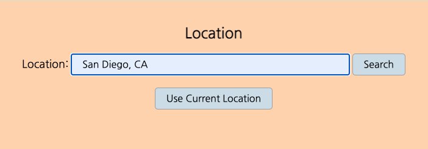

# Current-Beach-Weather

A current beach weather application. Users can plan their beach day by accessing weather and tide information.

## Live Demo

[Live Demo](https://7424243.github.io/current-beach-weather/)

## Screenshots

### Landing Page:

### Location Search Section:

### Results Section:

## Summary

To access current weather details about a particular coastal city or beach, users can either enter the location of the desired place or, if they are currently at the beach, they can use the browser location feature by clicking on the "Use Current Location" button. After the location search as been activated, the application will fetch data from various APIs (this could take a couple of seconds). Once the appropriate data is collected, it will be displayed in the Results section. The user should be able to see the current temperature, weather type, humditiy level and wind speed. They should also be able to see the day's high and low tide times as well as the sunrise and sunset times and the phase of the moon.

## Built With

* HTML
* CSS
* JavaScript
* jQuery
